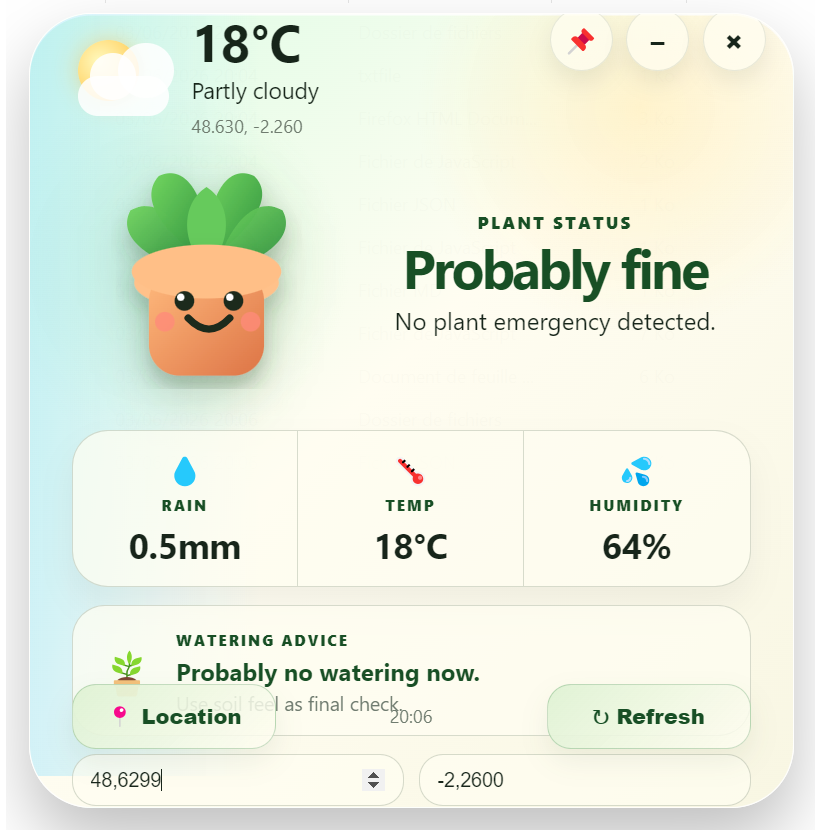

<div align="center">

# 🌿 Plant Watering Widget

### A compact Electron desktop widget that checks local weather and reminds you when your plants may need water


</div>

## About

A small Electron widget using Open-Meteo weather data to suggest whether plants may need watering.

Run with:

```powershell
npm.cmd install
npm.cmd start
```

Recommended setup:

```text
Windows
Node.js LTS v22.x
Electron 25
PowerShell with npm.cmd
```

## Preview

<p align="center">
  
</p>

A compact desktop widget that combines local weather data with simple plant-care recommendations.

### Current Features

- 🌿 Animated plant companion
- ☀️ Temperature monitoring
- 💧 Rain prediction
- 💦 Humidity tracking
- 🪴 Watering suggestions
- 📍 Geolocation support
- 📌 Pin-to-desktop mode
- 🔄 One-click refresh


MIT License
